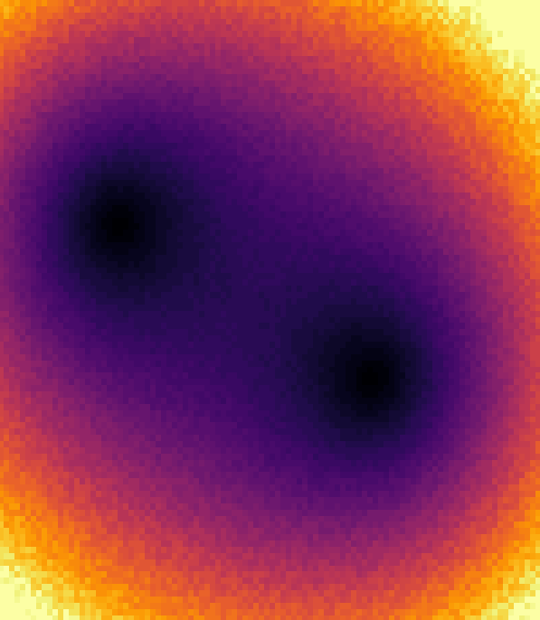
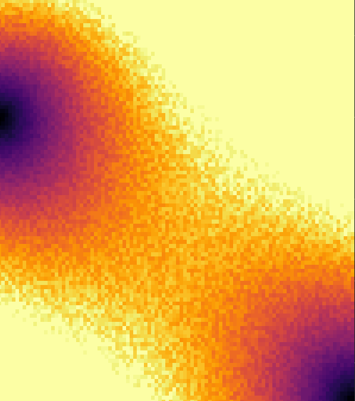

# Repo for storing code for UI Project for fast Quantum Dot measurements 

Project requires Python and Bokeh to be installed in an Anaconda environments


For Bokeh to open a browser tab with the interactive UI, run
``` bokeh serve --show <filename> ``` 

Write UI parameters in main.py, then run that file 

Important : make sure the files are being ran on the same OS as your browser (not through WSL etc.)


The Demo runs a complex quadratic with random noise which increases over time (useful for debug)